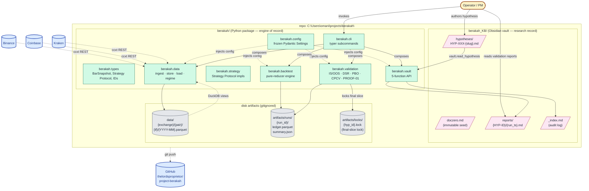
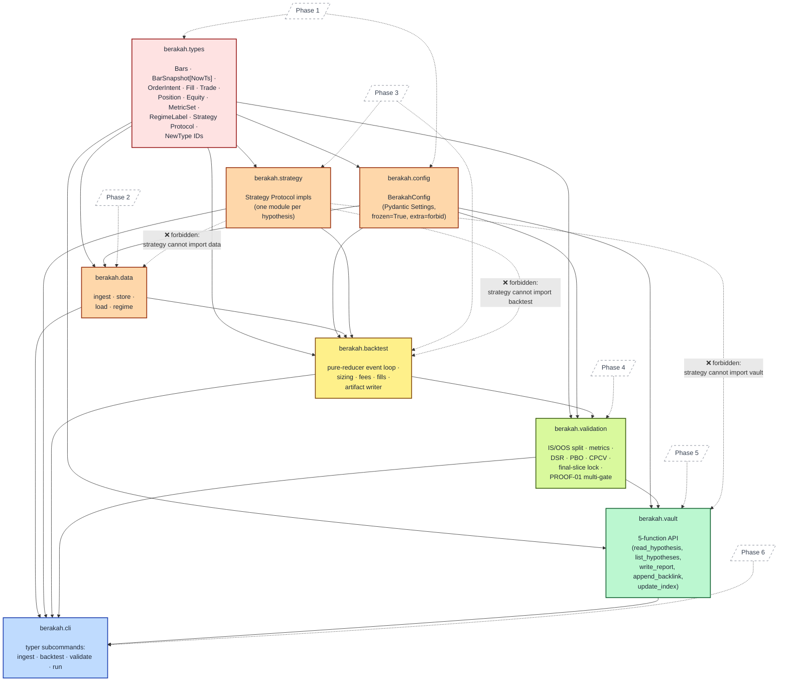
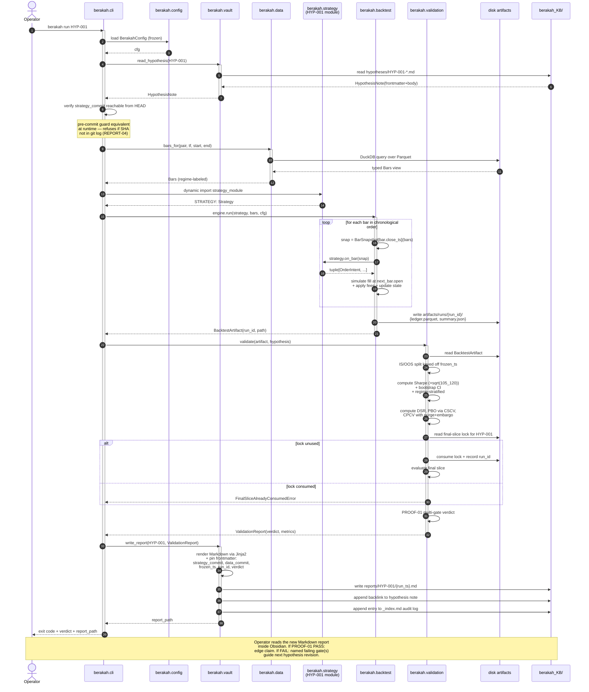
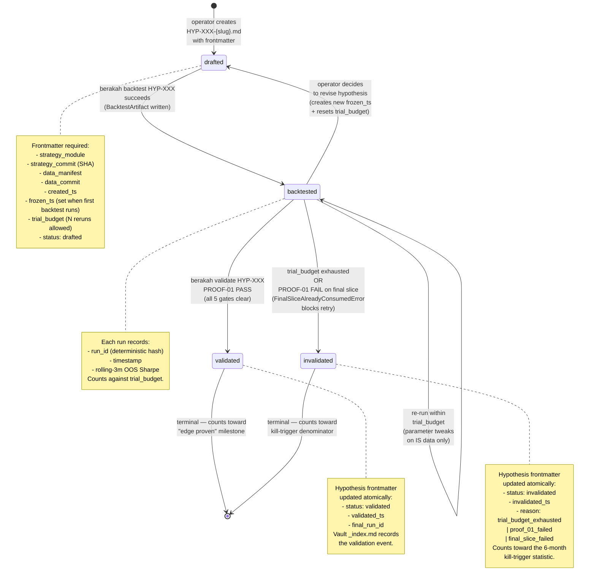
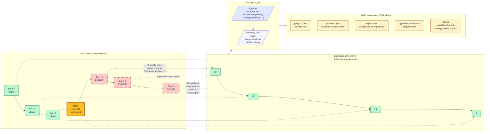

# Berakah — System Diagrams

**Created:** 2026-06-04
**Source of truth:** `.planning/research/ARCHITECTURE.md` (this doc visualizes; that doc specifies)
**Format:** Mermaid (renders natively on GitHub + Obsidian)

This document is the **visual living layer** of the Berakah Ring 1 design. Every diagram cites the ARCHITECTURE.md section it visualizes so drift is auditable. When ARCHITECTURE.md changes, regenerate or re-verify the affected diagram and update the citation.

## Contents

1. [System Architecture (zoomed out)](#1-system-architecture-zoomed-out) — actors, modules, storage, external systems
2. [Module Dependency DAG](#2-module-dependency-dag) — the strict acyclic import graph, CI-enforced
3. [Runtime Data Flow — `berakah run HYP-001`](#3-runtime-data-flow--berakah-run-hyp-001) — end-to-end sequence of one full research loop
4. [Hypothesis Lifecycle State Machine](#4-hypothesis-lifecycle-state-machine) — `drafted → backtested → validated | invalidated`
5. [Look-Ahead Defense — Type Contract View](#5-look-ahead-defense--type-contract-view) — how `BarSnapshot[NowTs]` makes future-bar leakage unrepresentable

---

## 1. System Architecture (zoomed out)

**Visualizes:** ARCHITECTURE.md §1.1 (system context) and §6 (project tree + vault placement).

The bird's-eye view: the operator (PM) authors hypotheses in the Obsidian vault; the `berakah` Python package consumes the vault note + the on-disk data + the on-disk config, runs the research pipeline, writes artifacts to disk, and writes a Markdown validation report *back* into the vault. External world is just Tier-1 exchanges (for historical OHLCV ingestion) and GitHub (for versioning).

**Reading the diagram:**
- The **vault** (pink) and the **Python package** (green) live as siblings in the repo. Both are tracked in git; the gitignored `data/` and `artifacts/` directories are deliberately *not* in git — they're regenerable from code + Parquet snapshots.
- The vault and code communicate through *one* legal touchpoint: `berakah.vault`'s 5-function API. No other module imports vault paths (CI-enforced by `import-linter`).
- The operator's daily loop is **author note → invoke CLI → read report back in vault.** Everything else is automation.

---

## 2. Module Dependency DAG

**Visualizes:** ARCHITECTURE.md §1.3 (build order) and §1.2 (module responsibilities).

This is the only legal acyclic build order. Every arrow is an *import* (downstream depends on upstream). `import-linter` is configured to reject any PR that introduces a reverse edge. Phase numbers reflect ROADMAP.md.

**Reading the diagram:**
- **Layer 0 (`types`)** has zero internal imports. It's the foundation. Phase 1 builds it before any logic exists.
- **Layer 1 (`config`, `data`, `strategy`)** can be built in parallel — they don't depend on each other.
- **Strategy is uniquely sandboxed**: it can only import from `types` and `config`. `import-linter` forbids edges to `data`, `vault`, `backtest`. The dotted red arrows show what CI rejects.
- **The DAG strictly forces the phase order.** You cannot build Phase 3 before Phase 1; Phase 4 cannot start until Phase 3's `BacktestArtifact` shape is stable.

---

## 3. Runtime Data Flow — `berakah run HYP-001`

**Visualizes:** ARCHITECTURE.md §3 (data flow table) and §4 (backtest pseudocode).

This is the **operator's daily loop** in full. The composite CLI command `berakah run HYP-001` triggers all five subsystems in sequence. Every disk write is an idempotent artifact addressed by `run_id`. The vault is touched twice: read at the start, written at the end.

**Reading the diagram:**
- **Step 6 (verify SHA reachable)** is the runtime arm of the vault/code-drift defense. The pre-commit guard (Pitfall 20 defense) blocks bad commits; this runtime check blocks bad *runs*.
- **The backtest loop (steps 11–14)** is where the look-ahead type contract pays off: `snap = BarSnapshot[bar.close_ts](bars)` is the *only* way the strategy sees bars. The phantom type forbids future-bar access at compile time.
- **The final-slice lock (steps 22–25)** is once-per-hypothesis. If the operator tries to re-run validation to "see if it goes up this time," they get `FinalSliceAlreadyConsumedError`. This is researcher-multiple-testing defense (Pitfall 4).
- **The vault writes (steps 29–32)** are atomic from the operator's perspective: report file + backlink + audit log in one transaction. The pre-commit guard runs before any of this is staged.

---

## 4. Hypothesis Lifecycle State Machine

**Visualizes:** REQUIREMENTS.md HYP-03 (lifecycle frontmatter status field) and PITFALLS.md Pitfall 22 (trial budget + cooling-off + kill-window).

Every hypothesis note has a `status` frontmatter field that moves through this state machine. The vault `_index.md` audit log records every transition. The 6-month project kill trigger sums `validated + invalidated` counts to determine "no signal absence."

**Reading the diagram:**
- **`drafted` is the only entry state**, and it requires the full frontmatter binding. No code runs until the note is well-formed.
- **`backtested → backtested` self-loop** is the legitimate researcher iteration: tweak parameters on IS data, re-run, see if signal strengthens. Each loop costs one trial-budget unit.
- **`backtested → invalidated`** has two triggers: trial budget exhausted (you're out of attempts) OR final-slice failure (the locked OOS slice killed the hypothesis). Both are terminal.
- **`backtested → drafted`** is the "I had the wrong hypothesis, let me re-think" path: the operator creates a *new* `frozen_ts` and `trial_budget`, effectively starting a fresh hypothesis. Old runs persist for audit but don't count against the new budget.
- **Both terminal states feed the project kill-trigger statistic.** If after 6 months no hypothesis has reached `validated`, the project ends.

---

## 5. Look-Ahead Defense — Type Contract View

**Visualizes:** ARCHITECTURE.md §2 (the `BarSnapshot[NowTs]` pattern) and PITFALLS.md Pitfalls 1, 2 (look-ahead bias).

This is the load-bearing safety asset of the entire engine. The strategy only ever receives a `BarSnapshot[NowTs]` — a phantom-typed view of the full bar history that is *structurally incapable* of exposing bars at or after `now_ts`. The Python type system, `pyright --strict`, `import-linter`, and `hypothesis` adversarial tests together make leakage impossible to write.

**Reading the diagram:**
- **The bar timeline (top)** shows what exists in the data store. Green bars are closed; the orange "now" bar just closed; red bars are future bars the strategy must not see.
- **The `BarSnapshot[NowTs=t]`** is a typed view that exposes only bars with `close_ts <= t`. There is no `.future_bars()` method. There is no way to call `snap[t+1]`.
- **The strategy signature** `on_bar(snap: BarSnapshot[NowTs])` is the *only* legal entry point. The strategy module cannot import `berakah.data` (import-linter blocks it), so it cannot reach the full Bars history sideways.
- **Five enforcement layers** make this CI-blocking:
  1. `pyright --strict` — phantom-typed generic rejects construction with future bars at compile time.
  2. `phantom-types` predicate — runtime backstop at construction.
  3. `import-linter` — strategy module cannot import `data`, `vault`, or `backtest`.
  4. `hypothesis` adversarial tests — tries to find inputs that produce leaky snapshots; CI fails if it does.
  5. `ruff` rule — strategy parameters cannot be `pd.DataFrame` (too easy to leak through).

**Why this matters:** Pitfall 1 (look-ahead bias) is *the* single failure mode that destroys a research engine's core value. Most quant systems police it through code review and prayer. Berakah makes it **impossible to write code that leaks.** The architecture is the guarantee.

---

## Maintenance discipline

This document is one of the four living docs maintained at phase transitions. Refresh triggers:

1. **After ARCHITECTURE.md changes** — re-verify each diagram against its cited ARCHITECTURE section. Update Mermaid source to match.
2. **After a new module is added or moved** — Diagrams 1 and 2 need updates; check if Diagram 3 sequence changes.
3. **When a control-flow assumption changes** (e.g., backtest engine becomes async, or vault gains a new touchpoint) — re-verify Diagram 3.
4. **When a lifecycle state is added or transitions change** — Diagram 4 needs updates.
5. **When the type contract changes** (extremely rare; would be a major architecture revision) — Diagram 5 needs updates.

Drift between this doc and ARCHITECTURE.md is a phase-transition blocker — fix the diagrams before declaring the phase complete.

---
*Last updated: 2026-06-04 after initialization*
